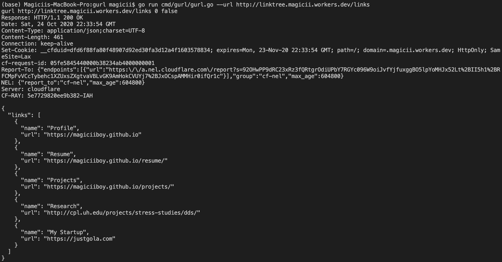
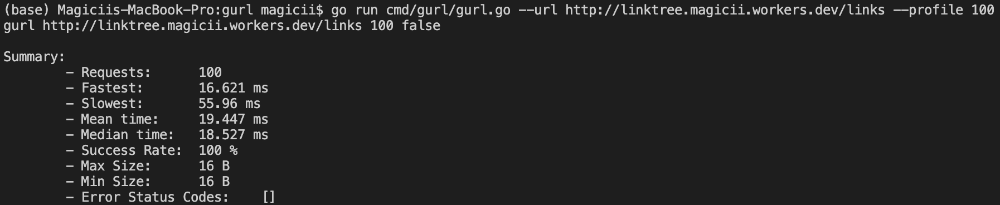

# gURL - A simplest version of cURL written in Go
A command-line tool that handles the HTTP requests  
This package uses HTTP/1.1 accordingly to RFC 7230.

## Limitations
Of course, this has a lot of limitations since it has a very simple implementation.
- Only support HTTP/1.1 with persistent connection
- Only support method GET
- Only support http scheme
- No Authentication
- No Cookie/Session

## Usage
```bash
usage: gurl [-h|--help] -u|--url "<value>" [-p|--profile <integer>]
            [-v|--verbose]

            A simplest version of cURL written in Go

Arguments:

  -h  --help     Print help information
  -u  --url      URL to request
  -p  --profile  Profile n requests
  -v  --verbose  Print details
```

## How to run
### Send an HTTP Request
```bash
go run cmd/gurl/gurl.go --url http://linktree.magicii.workers.dev/links
```

```bash
Request:
GET /links HTTP/1.1
Host: linktree.magicii.workers.dev
User-Agent: gurl/0.0.1
Accept: */*

Response:
HTTP/1.1 200 OK
Date: Sat, 24 Oct 2020 23:55:14 GMT
Content-Type: application/json;charset=UTF-8
Content-Length: 461
Connection: keep-alive
Set-Cookie: __cfduid=dafdd13891ccdd2979d8952884dd7f5ee1603583714; expires=Mon, 23-Nov-20 23:55:14 GMT; path=/; domain=.magicii.workers.dev; HttpOnly; SameSite=Lax
cf-request-id: 05fea2bced0000febaf4a35000000001
Report-To: {"endpoints":[{"url":"https:\/\/a.nel.cloudflare.com\/report?s=8ZRGwsaUtLnl7ylbtXGoSiRxROF58B3NCIQPIJnKOVopMnxy1oWOo8MhYEYkFQpTlhwHNM4p%2BhU1kAMu0u%2BVm3ZdJw%2BXPihFJls6%2Fr1GVskbSJQvB5elx6ryMvdzmVlVpNUQevs6A%2Bjs"}],"group":"cf-nel","max_age":604800}
NEL: {"report_to":"cf-nel","max_age":604800}
Server: cloudflare
CF-RAY: 5e77a0a7eafffeba-IAH

{
  "links": [
    {
      "name": "Profile",
      "url": "https://magiciiboy.github.io"
    },
    {
      "name": "Resume",
      "url": "https://magiciiboy.github.io/resume/"
    },
    {
      "name": "Research",
      "url": "http://cpl.uh.edu/projects/stress-studies/dds/"
    }
  ]
}
```

### Profile
```bash
go run cmd/gurl/gurl.go --url http://linktree.magicii.workers.dev/links --profile 100
```

```bash
Request:
GET /links HTTP/1.1
Host: linktree.magicii.workers.dev
User-Agent: gurl/0.0.1
Accept: */*

Summary:
        - Requests:      10 
        - Fastest:       18.779 ms 
        - Slowest:       68.706 ms 
        - Mean time:     29.192 ms 
        - Median time:   26.5585 ms 
        - Success Rate:  100 % 
        - Max Size:      16 B 
        - Min Size:      16 B 
        - Error Status Codes:
```

## Examples
### Send an HTTP Request


### Profile

