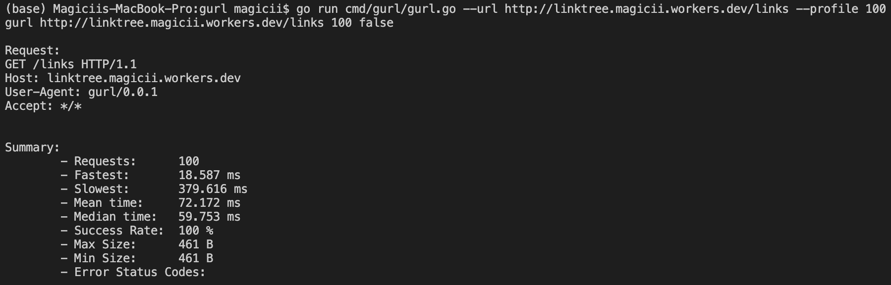

# gURL - A simplest version of cURL written in Go
A command-line tool that handles the HTTP requests  
This package uses HTTP/1.1 accordingly to RFC 7230.

## Limitations
Of course, this has a lot of limitations since it has a very simple implementation.
- Only support HTTP/1.1
- Only method GET
- Only support http scheme
- No Authentication
- No Cookie/Session

## Usage
```bash
usage: gurl [-h|--help] -u|--url "<value>" [-p|--profile <integer>]
            [-v|--verbose]

            A simplest version of cURL written in Go

Arguments:

  -h  --help     Print help information
  -u  --url      URL to request
  -p  --profile  Profile n requests
  -v  --verbose  Print details
```

## How to run
### Send an HTTP Request
```bash
go run cmd/gurl/gurl.go --url http://linktree.magicii.workers.dev/links
```

### Profile
```bash
go run cmd/gurl/gurl.go --url http://linktree.magicii.workers.dev/links --profile 100
```

## Examples
### Send an HTTP Request


### Profile

